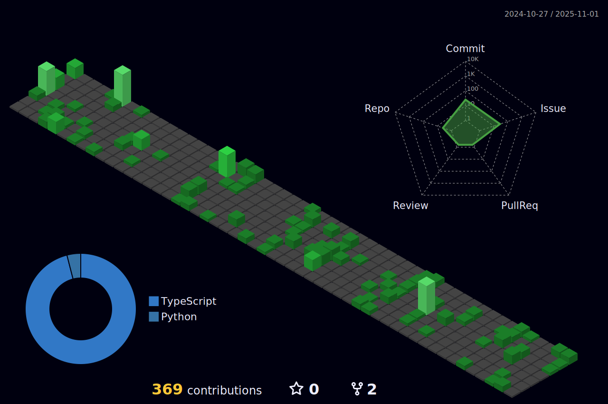

### Hello I'm Robson da Silva

- 🔭 Trabalho como Front-end Developer na Gateware.
- 🌱 Estou atualmente aprendendo Flutter/Dart
- 😄 Tenho conhecimento amplo em React | Vue/Vuex | Dart/Flutter

 

<!-- Tecnologis que domino -->

 

 
 

<!-- Endereços para contato -->

 
 

  
 
  
   	 
  
      

  
  
